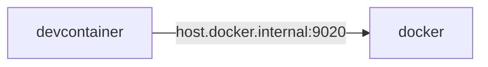

# go-spanner-example
Try Cloud Spanner and emulators.



## Usage
```bash
docker pull gcr.io/cloud-spanner-emulator/emulator
docker run -p 9010:9010 -p 9020:9020 gcr.io/cloud-spanner-emulator/emulator
```

```bash
curl http://host.docker.internal:9020
```

```bash
export SPANNER_EMULATOR_HOST=host.docker.internal:9010
echo $SPANNER_EMULATOR_HOST
```

## Reference
- [Cloud Spanner Emulator](https://github.com/GoogleCloudPlatform/cloud-spanner-emulator)
